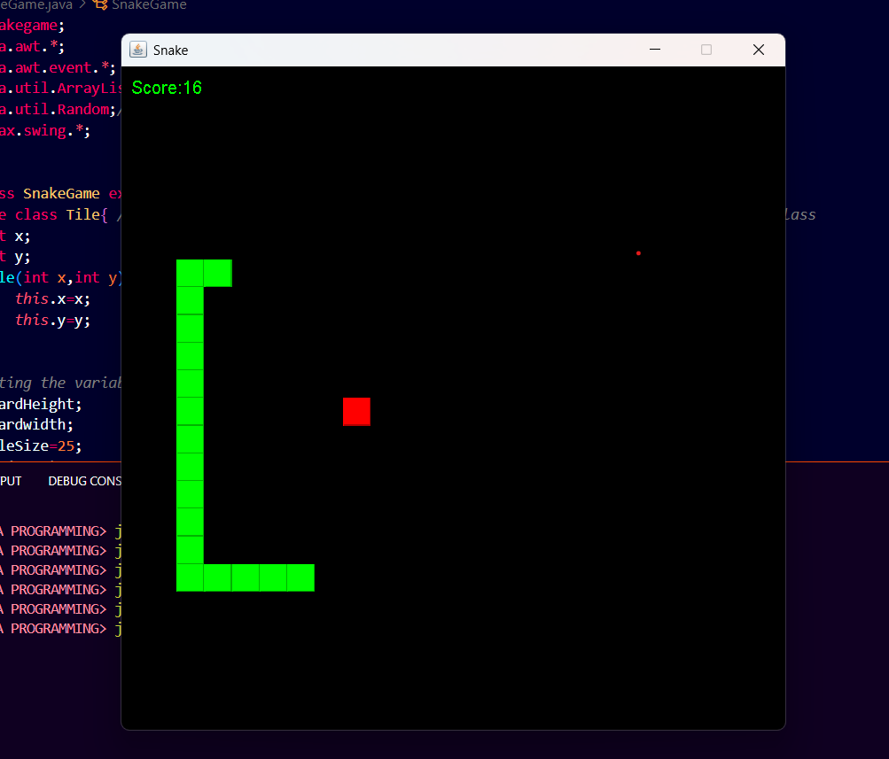

# 🐍 Snake Game — Java Swing Edition

A classic Snake game built using **Java AWT & Swing** libraries. This is a simple desktop application where the player controls the snake to eat food and grow longer, avoiding collisions with walls and itself.

---

## 📷 Screenshot



---

## 🚀 How to Run

### 🧰 Requirements:
- Java JDK installed
- Terminal or any IDE (e.g., IntelliJ, Eclipse, VS Code)

### 🔧 Steps to Compile & Run:

```bash
# Navigate to the source directory
cd Snakegame-Java-Swing

# Compile the code
javac Snakegame/*.java

# Run the main class (with package)
java Snakegame.App

folder structure

Snakegame-Java-Swing/
├── Snakegame/              # Java source files
│   ├── App.java
│   ├── SnakeGame.java
│   └── ...
│
├── out/                    # Compiled .class files (optional)
│   └── Snakegame/
│       ├── App.class
│       └── SnakeGame.class
│
├── assets/                 # Screenshots or demo
│   └── screenshot.png
│
├── .gitignore
└── README.md